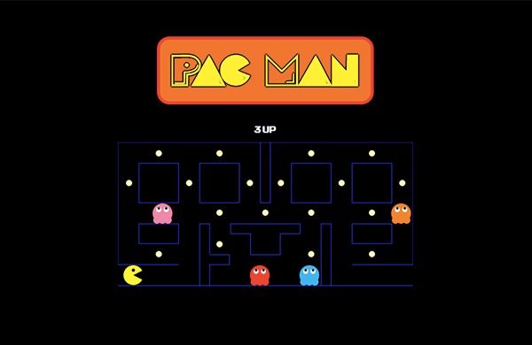

# Pac Man

## About the game
This was the first individual project at Ironhack, Barcelona. The task was to develop a game using pure Javascript, CSS, HTML and the deadline was 5 working days. 

I choose to build a ES6 PacMan game using a raw html canvas, no grids or images, everything is painted and animated in each frame, something that was much more challenging than anticipated but the end result is a much smoother game than most other html implementations out there.

You can play the game [here](http://ansolantz.github.io/pac-man)

### The main challenges were:

1. **Animating PacMans mouth** opening and closing, but with some help from the arc drawing tool it was quite quick to solve.

2. **Detecting collisions**. My solution for this was to cut out a 1px wide rectangle in front of pacman and the ghosts. This serves as a snowplough checking the next frame and thanks to this collision detection can be done by just checking the pixel color for 32 pixels (the height) for each sprite. Candy collision detection uses a more traditional method since when PacMan eat the candy, I only have the approximate position.

3. **Building the maze.** Everything is pixel perfect meaning that the width of the path PacMan and the ghosts move around in is exactly the size of the sprites. This is nice since they can not turn and face a wall (like the real game). This however required that all paths in the maze had exactly the right size something that took quite some time to get right and that is the reason the maze is not bigger than it is due to the time constraints.

   

------

## States & Transitions
Definition of the different states and their transition(transition functions)

  - splashScreen
    - hideGameOver()
    - buildSplash()
    - addEventListener(startGame)
    
  - gameScreen
    - hideSplash()
    - hideGameOver()
    - create new Game()
    - game.start()
  
  - gameoverScreen
    - hideGame()
    - buildGameOver()
    - addEventListener(startGame) 

